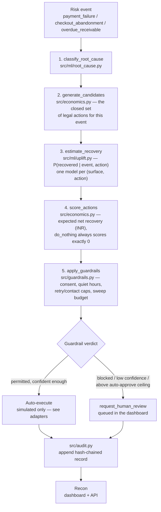
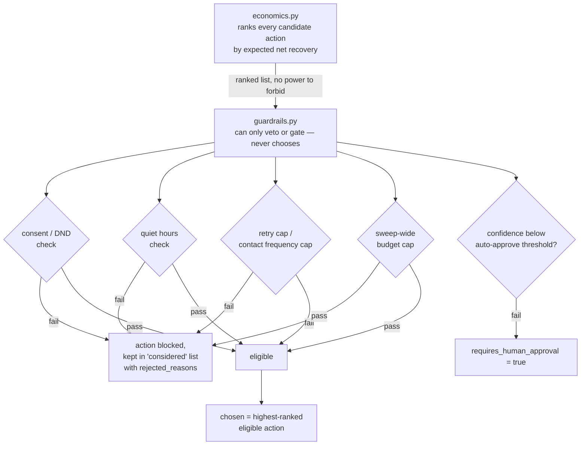
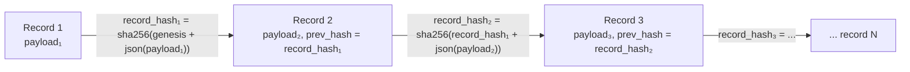
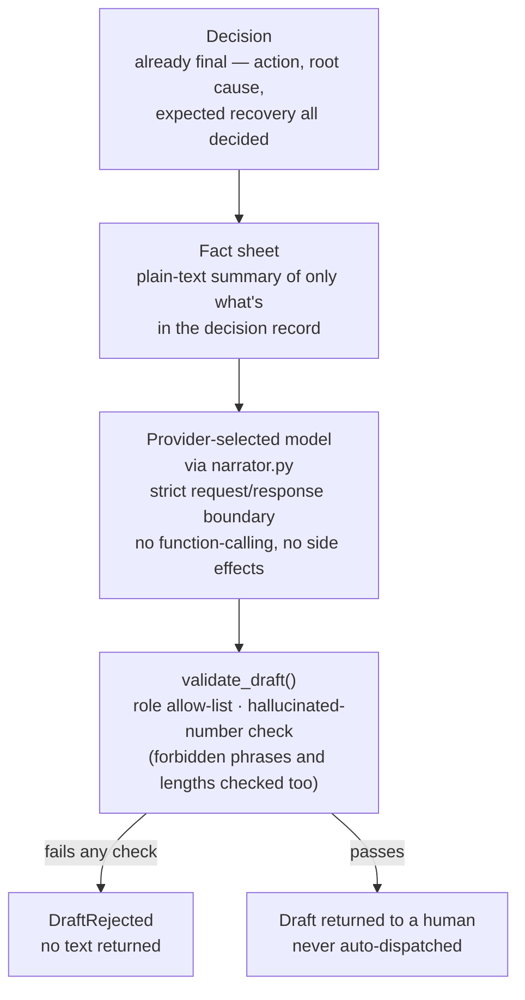

# Revenue Recovery Agent
An agent that decides whether to retry a failed payment, wait, offer a
bounded discount, chase an overdue invoice, escalate to a human, or
deliberately do nothing — ranked by **expected net recovery**, constrained
by hard financial and consent guardrails, and recorded in an **append-only,
hash-chained audit trail**. Built for the Razorpay AI Buildathon, AI Revenue
Recovery track.

This version adds the optional narration layer (`src/narrator.py`): a strict
LLM boundary that can draft customer-facing or reviewer-facing text only from
precomputed fact sheets, never from raw event text or free-form prompts. The
LLM is intentionally optional: the recovery pipeline continues to function
without it, while narration remains a convenience layered on top.

Code version: 3.1.0
Policy version: 3.1.0

Every claim below was checked by running the pipeline, not by reading the
docstrings that describe it. Where a number appears, it was reproduced
during this review, matched what `artifacts/verified_metrics.md` already
recorded, and differed only by floating-point noise.

## Quick start

```bash
pip install -r requirements.txt
python run.py
```

That runs the synthetic-data generator, trains the models, executes the
recovery sweep, verifies the audit chain, and opens the dashboard. It skips
steps whose outputs already exist, so repeated runs stay fast and safe.

```bash
python run.py --no-serve   # build everything, skip the dashboard
python run.py --check      # verify the audit chain + run tests
python run.py --force      # redo every step, including a fresh sweep
python run.py --port 8080  # dashboard on a specific port
```

### Optional LLM setup

Narration is enabled only when a provider key is present in the OS
environment. The project accepts several provider names and uses the
`llm.provider` value in `config/policy.yaml` to pin a vendor or leave it as
`auto`.

PowerShell examples:

```powershell
$env:ANTHROPIC_API_KEY="sk-ant-..."
# or
$env:OPENAI_API_KEY="sk-..."
# or for custom OpenAI-compatible gateways
$env:LLM_API_KEY="..."
$env:LLM_BASE_URL="https://your-gateway.example.com/v1/chat/completions"
```

The project accepts these variable names for the built-in providers:

- ANTHROPIC_API_KEY
- OPENAI_API_KEY
- GEMINI_API_KEY / GOOGLE_API_KEY
- GROQ_API_KEY
- MISTRAL_API_KEY
- DEEPSEEK_API_KEY
- OPENROUTER_API_KEY
- XAI_API_KEY
- LLM_API_KEY (custom provider)

One further variable is recognised and is not a key:

- LLM_BASE_URL — the endpoint to POST to, equivalent to `llm.base_url` in
  `config/policy.yaml`, which takes precedence over it. Required for the
  custom provider and optional for the others, where it overrides that
  vendor's default endpoint.

A custom endpoint is checked before anything is sent to it: https is
required, or plain http only to 127.0.0.1, ::1 or localhost so that a local
Ollama or vLLM works; no credentials in the userinfo position, because a key
belongs in a header rather than in a URL that gets logged; and no query
string. The reason is that the fact sheet is relationship context — segment,
tenure, contact history, amounts — so the set of hosts it may be POSTed to
should be bounded rather than whatever a config file happens to name.

`llm.model` in the same config file selects the model, and blank means the
provider's own default, so one config works with an Anthropic key or a
Gemini one.

The key itself is never written into the generated draft or stored in the
recovery record.

**Why re-running isn't the default behaviour of a bare command.** Two
of these steps aren't idempotent the way a build step is:
`data/generate_all.py` rewrites the CSVs, and the audit trail is
append-only, so a second sweep doesn't replace the first — it adds to it.
Silently redoing either on every run would quietly invalidate the exact
figures this README and `artifacts/verified_metrics.md` quote. So
`run.py` builds only what's missing by default, and `--force`
says out loud what it's about to change before it changes it.

Nothing about `run.py` is required — every step is a single
command, listed individually below, and running them by hand is the
better way to actually understand the project.

### The steps, individually

```bash
python data/generate_all.py            # synthetic customers + 3 event types
python -m src.train                     # fit root-cause + per-action recovery models
python -m src.agent run --split test    # sweep the held-out split, write the audit trail
python -m src.benchmark                 # agent vs. baselines, bootstrapped CIs
python -m src.agent verify              # check the audit hash chain
python -m src.server --open             # Recon dashboard
```

**Run everything with `-m` from the project root**, not
`python src/train.py`. The package uses relative imports
(`from . import config`), so invoking a file directly inside `src/`
fails with `ImportError: attempted relative import with no known parent
package`. `run.py` always uses the correct form for you.

## What makes this different from "detect a failure, retry it"

Most recovery systems automate retries. This agent decides _whether_ to
retry, wait, incentivise, contact, route to finance, or deliberately do
nothing — ranked by expected net recovery, not by a fixed rule per root
cause. Doing nothing is a first-class, often-correct output: every action
is scored as its incremental value _against_ doing nothing, so
`do_nothing` always scores exactly zero, and a negative-value action is
provably worse than inaction rather than merely undesirable.

## Architecture diagrams

### End-to-end decision pipeline

Every risk event — a failed payment, an abandoned cart, an overdue
invoice — walks the same fixed, five-step plan (`src/tools.py`). No
branching, no LLM in this loop.



### System components

```mermaid
flowchart LR
    subgraph Data["data/"]
        GEN["generate_all.py\ncustomers, payments,\ncheckout, receivables"]
    end

    subgraph Core["src/"]
        SCHEMAS["schemas.py\nclosed action vocabulary\nRiskEvent / Decision / ScoredAction"]
        CONFIG["config.py\nloads + freezes\nconfig/policy.yaml"]
        ML["ml/\nlogistic.py (hand-rolled, no sklearn)\nroot_cause.py, uplift.py, features.py"]
        ECON["economics.py\nproposes — cannot block"]
        GUARD["guardrails.py\ndisposes — can only veto/gate"]
        TOOLS["tools.py\nfixed 5-step plan"]
        AGENT["agent.py\nsweep orchestrator\nCLI: run / pending / verify"]
        AUDIT["audit.py\nhash-chained JSONL\n+ execution ledger"]
        ADAPT["adapters/\nrazorpay.py, messaging.py,\ninvoicing.py — simulated only,\nno live transport exists"]
        NARR["narrator.py\nLLM speaks, never decides\nvalidated output only"]
        SVC["service.py\ndashboard business logic"]
        SRV["server.py\nstdlib http.server\nno framework, no auth"]
    end

    subgraph UI["web/"]
        DASH["index.html\nRecon\nCSP-hardened, no CDN calls"]
    end

    RUN["run.py\none command,\norchestrates everything below"]

    RUN --> GEN
    GEN --> SCHEMAS
    CONFIG --> TOOLS
    SCHEMAS --> ML --> ECON --> TOOLS
    ECON --> GUARD --> TOOLS
    TOOLS --> AGENT --> AUDIT
    AGENT --> ADAPT
    AUDIT --> SVC --> SRV --> DASH
    SVC --> NARR
    NARR -.optional, requires\nany provider API key.-> SVC
    RUN --> SRV
```



### Guardrails: economics proposes, guardrails disposes



Fraud-suspected payments are a deliberate example of **defence in
depth**: penalised by the chargeback term in the economics scoring _and_
hard-blocked in guardrails _and_ excluded by the never-retry root-cause
list in `config/policy.yaml`. Three independent mechanisms, so a gap in
one doesn't become a gap in the system.

### Audit trail: hash chain



`python -m src.agent verify` recomputes every hash from genesis and
compares it to what's stored. Tampering with a single field in one
record breaks verification at that exact line — the reason and record id
are printed, not a generic "corrupted" message. The file is append-only:
running a sweep twice grows it, it never truncates or overwrites, which
is exactly why `run.py` treats an existing audit trail as
"done" rather than redoing it silently.

### LLM narration boundary



The LLM renders already-decided facts into language; it cannot choose an
action, invent a number absent from the source decision, or reach a
customer directly. This boundary is enforced by `src/narrator.py` and the
matching tests in `tests/test_narrator.py`, which cover hallucinated
figures, forbidden phrases, role restrictions, and safe prompt construction.

## Repository structure

```
run.py    -> one command: build everything, then serve

data/
  generate_*.py    -> synthetic customers, payments, checkout, receivables
  audit/decisions.jsonl   -> the live, hash-chained audit trail
  audit/archive/          -> retired audit records, kept not deleted (see its README)

src/
  schemas.py       -> closed action vocabulary; RiskEvent / Decision / ScoredAction.
  config.py        -> loads + freezes config/policy.yaml; every decision is
                       stamped with the policy_version that produced it
  ml/
    logistic.py    -> hand-rolled logistic regression (no scikit-learn)
    features.py    -> shared train/serve feature encoding
    root_cause.py  -> why a payment failed / cart was abandoned / invoice is overdue
    uplift.py      -> P(recovered | event, action), one model per (surface, action)
  economics.py     -> turns probabilities into expected net recovery (INR)
  guardrails.py    -> vetoes or gates actions: consent, quiet hours,
                       retry/contact caps, sweep-wide budgets, approval gates
  tools.py         -> the fixed 5-step plan the agent walks for every event
  agent.py         -> orchestrates a sweep; CLI: run / pending / verify
  audit.py         -> append-only, hash-chained JSONL store; execution ledger
  adapters/        -> simulated adapters for messaging, invoicing, and gateway calls
  narrator.py      -> optional LLM narration layer; strict output validation + safe prompt construction
  service.py       -> business logic behind the dashboard API
  server.py        -> stdlib-only HTTP server serving the dashboard + API
  benchmark.py     -> agent vs. baselines with bootstrapped confidence intervals
  web/index.html   -> Recon dashboard

config/policy.yaml   -> tunable limits for discount caps, retry caps,
                        contact frequency, quiet hours, auto-approve ceilings

artifacts/           -> trained model JSON, benchmark output, verification notes

tests/               -> defensive posture, audit integrity, economics,
                        guardrail policy, narrator boundary, and server API checks
```

## Where the details actually live

This README is the map, not the territory — the specifics are documented
where they're authoritative, not duplicated here where they'd drift out
of sync:

- **[`MODEL_CARD.md`](MODEL_CARD.md)** — what the models are, how well
  they perform (with baselines, not bare accuracy), and an honest section
  on why simple models were a deliberate choice for this problem
- **[`SECURITY.md`](SECURITY.md)** — the defensive posture, organised by
  what the system _cannot_ do, with the mechanism and the test that holds
  each one down
- **[`artifacts/verified_metrics.md`](artifacts/verified_metrics.md)** —
  every number that appears anywhere in this project's documentation,
  with the exact command that produced it. Nothing is quoted here that
  isn't recorded there first.
- **[`CHANGELOG.md`](CHANGELOG.md)** — what changed from v2 to v3 and why,
  including the bugs found on the way and what each one cost to find
- **`improvements.md`** — the original design brief this project was built
  against. It lives with the previous version rather than here, because it
  describes work this version has done rather than work it plans to do.

## Known limitations

- **No production WSGI/ASGI server.** `src/server.py` is a stdlib
  `http.server` instance intended for local dashboard use — it prints
  `loopback only, no authentication — do not expose this port` on
  startup, and means it.
- **No authentication.** The operator name on an approval request
  records who _claimed_ responsibility; it isn't an identity check.
  Wiring a real identity layer is a small, isolated change, not a
  redesign — but it isn't done here.
- **Hash-chain gives tamper _evidence_, not tamper _proofing_.** Someone
  with write access to the audit file could recompute the entire chain
  from genesis. Real immutability needs an external anchor (WORM
  storage, or shipping the chain head somewhere the agent can't reach).
- **All data is synthetic.** Recovery probabilities, customer profiles,
  and outcomes are simulated. The uplift numbers in
  `artifacts/verified_metrics.md` describe how well the agent's policy
  performs against the simulator's ground truth, not real-world recovery
  rates.
